# Magnificent 7 Covered Call Strategy Backtest Report

**Period:** January 2021 – December 2025 (60 months)  
**Initial Capital:** $100,000 USD per stock  
**Stocks:** AAPL, MSFT, GOOGL, AMZN, NVDA, META, TSLA  
**Report Date:** February 2026

---

## Table of Contents

1. [Executive Summary](#1-executive-summary)
2. [Methodology & Key Concepts](#2-methodology--key-concepts)
3. [Part I: Buy & Hold Returns](#3-part-i-buy--hold-returns)
4. [Part II: Covered Call Premium Income (Fixed Delta)](#4-part-ii-covered-call-premium-income-fixed-delta)
5. [Part III: Net CC Overlay — Premium Minus Assignment Cost](#5-part-iii-net-cc-overlay--premium-minus-assignment-cost)
6. [Part IV: Delta Grid Search — Optimal Strategy per Stock](#6-part-iv-delta-grid-search--optimal-strategy-per-stock)
7. [IV-Delta Relationship & Regime Analysis](#7-iv-delta-relationship--regime-analysis)
8. [Discussion & Key Insights](#8-discussion--key-insights)
9. [Future Investment Recommendations](#9-future-investment-recommendations)
10. [Appendix: Data Sources & Limitations](#10-appendix-data-sources--limitations)

---

## 1. Executive Summary

This report backtests a **monthly covered call (CC) overlay strategy** on the Magnificent 7 stocks over the 2021–2025 period. The goal: hold these stocks long-term while generating additional cash flow by selling monthly OTM call options. We analyze progressively from simple to complex:

**Key Findings:**

| Stock | B&H Return | Best CC Net | Combined Return | Optimal Delta | CC Grade |
|-------|-----------|-------------|-----------------|---------------|----------|
| AAPL  | +85.3%    | +12.0%      | **+97.3%**      | 0.08          | B+       |
| MSFT  | +104.3%   | +13.6%      | **+118.0%**     | 0.18          | B+       |
| GOOGL | +110.8%   | +23.5%      | **+134.3%**     | 0.10          | A        |
| AMZN  | +34.0%    | +37.7%      | **+71.7%**      | 0.35          | A        |
| NVDA  | +937.2%   | +119.1%     | **+1,056.3%**   | 0.18          | A+       |
| META  | +115.9%   | +23.7%      | **+139.6%**     | 0.18          | A        |
| TSLA  | +54.4%    | +4.0%       | **+58.4%**      | 0.25          | B        |

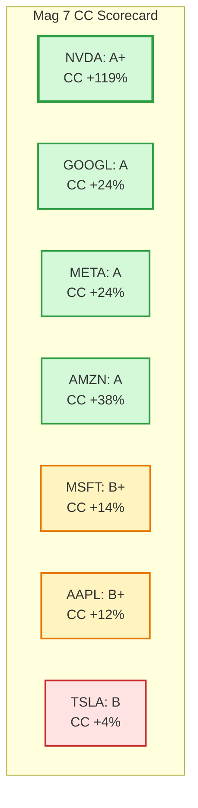

> **Bottom line:** With optimized delta, CC overlays added positive income for **all 7 stocks** over the 5-year period. The optimal delta varies significantly by stock, ranging from 0.08 (AAPL) to 0.35 (AMZN), driven by each stock's growth pattern and implied volatility.

---

## 2. Methodology & Key Concepts

### 2.1 Strategy Definition

We implement a **covered call overlay** model:

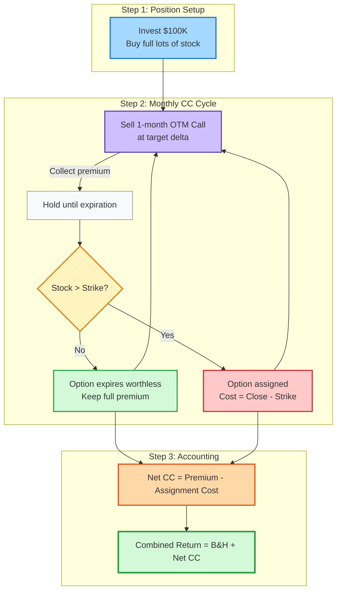

1. **Buy & Hold (B&H):** At the start of January 2021, invest $100,000 to buy as many full lots (100 shares) as possible. Hold continuously through December 2025.
2. **CC Overlay:** Each month, sell 1-month call options against the full position. The covered call is purely an income overlay — the underlying shares are **always held** and never sold.
3. **Assignment Accounting:** When the stock closes above the strike at expiration, the call is "assigned." In the overlay model, this is treated as a **cost** equal to `(close − strike) × shares`, representing the upside you gave up. The shares are never actually sold.

### 2.2 Key Concepts

#### Delta (Δ)

Delta measures the **sensitivity of an option's price to a $1 change in the underlying stock**. For call options:

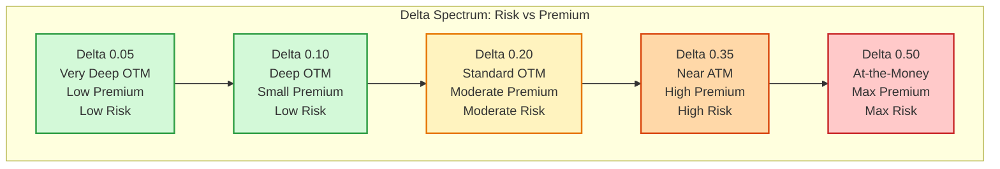

- **Δ = 0.50:** At-the-money (ATM). The option has roughly a 50% probability of expiring in-the-money (ITM).
- **Δ = 0.20:** Out-of-the-money (OTM). Approximately 20% probability of being ITM at expiration. This is a common institutional choice.
- **Δ = 0.10:** Deep OTM. Only ~10% chance of assignment. Very conservative.
- **Δ = 0.05:** Very deep OTM. Minimal premium, minimal assignment risk.

**Why delta matters for CC strategies:** A higher delta means selling a call closer to the current stock price. This generates **more premium** but also means **more frequent assignment** (giving up more upside). Delta serves as a standardized risk measure across different stocks and volatility levels.

#### Implied Volatility (IV)

IV represents the **market's expectation of future price fluctuation**, expressed as an annualized percentage. Higher IV means:

- **Larger expected price swings** (both up and down)
- **Higher option premiums** (options are more expensive)
- **More "fuel" for the CC strategy** (more premium to collect)

The relationship between IV and CC income is approximately **linear** — doubling IV roughly doubles the premium at any given delta.

#### Black-Scholes Model

We use the Black-Scholes model to price options and calculate delta:

$$C = S \cdot N(d_1) - K \cdot e^{-rT} \cdot N(d_2)$$

where:
- $S$ = stock price, $K$ = strike price, $T$ = time to expiration (in years)
- $r$ = risk-free rate (4% annualized), $\sigma$ = implied volatility
- $d_1 = \frac{\ln(S/K) + (r + \sigma^2/2)T}{\sigma\sqrt{T}}$, $d_2 = d_1 - \sigma\sqrt{T}$

For a given target delta, we **invert** this formula to find the appropriate strike price.

### 2.3 Market Environment 2021–2025

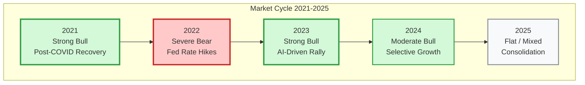

| Year | Market Regime | Description |
|------|--------------|-------------|
| 2021 | **Strong Bull** | Post-COVID recovery, all Mag 7 up (NVDA +127%, GOOGL +65%) |
| 2022 | **Severe Bear** | Fed rate hikes, all Mag 7 down (TSLA −69%, META −64%) |
| 2023 | **Strong Bull** | AI-driven rally, massive rebounds (NVDA +234%, META +184%) |
| 2024 | **Moderate Bull** | Continued growth but more selective (NVDA +178%, MSFT +13%) |
| 2025 | **Flat/Mixed** | Consolidation year, modest returns (MSFT +15%, TSLA −10%) |

This 5-year window covers a **full market cycle** — a rare and valuable testing ground that includes euphoria, crash, and recovery.

---

## 3. Part I: Buy & Hold Returns

### 3.1 Year-by-Year Stock Price Returns

| Stock | 2021 | 2022 | 2023 | 2024 | 2025 | **5-Year Total** |
|-------|------|------|------|------|------|-----------------|
| AAPL  | +33.8% | −26.9% | +53.9% | +30.3% | +4.4% | **+85.3%** |
| MSFT  | +51.1% | −28.4% | +56.9% | +13.1% | +15.4% | **+104.3%** |
| GOOGL | +65.0% | −38.9% | +56.3% | +34.9% | +0.0% | **+110.8%** |
| AMZN  | +2.0% | −49.5% | +78.3% | +45.0% | +0.1% | **+34.0%** |
| NVDA  | +126.7% | −50.4% | +233.9% | +177.6% | +0.3% | **+937.2%** |
| META  | +23.1% | −64.4% | +184.2% | +74.3% | +10.0% | **+115.9%** |
| TSLA  | +44.8% | −69.2% | +129.8% | +69.5% | −9.9% | **+54.4%** |

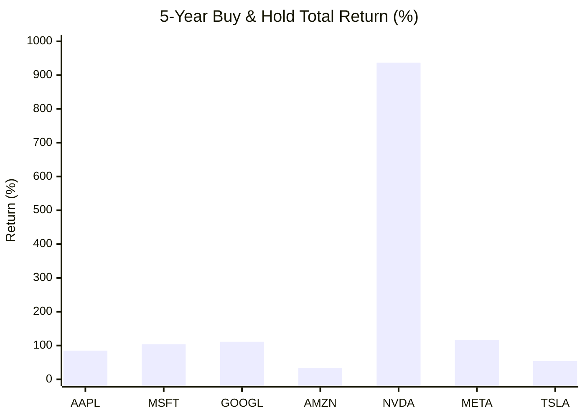

### 3.2 Portfolio Final Values ($100K Initial)

| Stock | Shares Bought | Entry Price | Exit Price | Final Value | Return |
|-------|--------------|-------------|------------|-------------|--------|
| AAPL  | 700          | $132.69     | $254.49    | $185,260    | +85.3% |
| MSFT  | 400          | $222.53     | $483.39    | $204,344    | +104.3% |
| GOOGL | 1,100        | $87.71      | $188.42    | $210,781    | +110.8% |
| AMZN  | 600          | $163.50     | $220.13    | $133,978    | +34.0% |
| NVDA  | 7,700        | $12.98      | $134.70    | $1,037,244  | +937.2% |
| META  | 300          | $273.16     | $659.40    | $215,872    | +115.9% |
| TSLA  | 400          | $243.26     | $379.28    | $154,408    | +54.4% |

> *Note: All prices are split-adjusted. NVDA had 4:1 (Jul 2021) and 10:1 (Jun 2024) splits; GOOGL had 20:1 (Jul 2022); AMZN had 20:1 (Jun 2022); TSLA had 3:1 (Aug 2022).*

### 3.3 Market Regime Classification

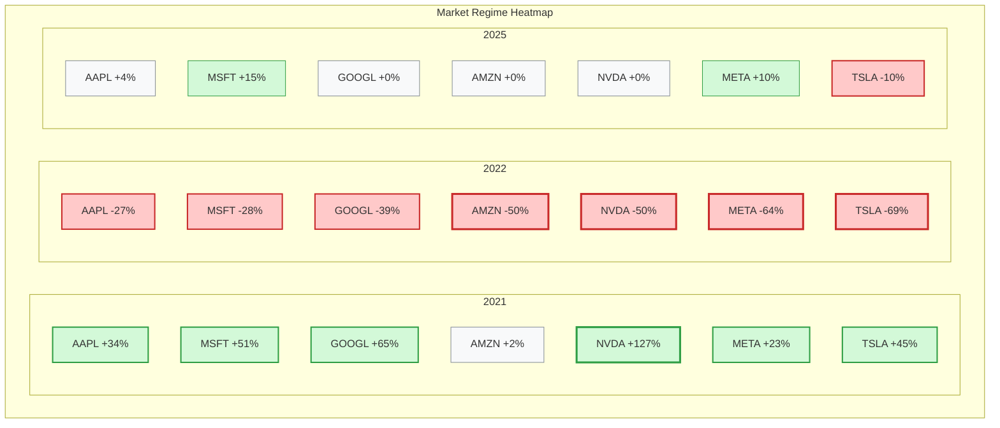

**Interpretation:**
- NVDA was the undisputed winner with a staggering **+937%** return, driven by the AI revolution.
- The 2022 bear market was universal and brutal — no Mag 7 stock was spared.
- 2025 was a consolidation year with flat-to-modest returns for most stocks.
- AMZN underperformed significantly (+34%) due to its large 2022 drawdown and slow recovery.

---

## 4. Part II: Covered Call Premium Income (Fixed Delta)

We begin with a **fixed delta of 0.20** — a commonly used level that represents approximately 20% probability of assignment, or roughly 10% out-of-the-money.

### 4.1 Annual CC Premium Income

| Stock | 2021 | 2022 | 2023 | 2024 | 2025 | **5-Year Total** | **$/month** |
|-------|------|------|------|------|------|-----------------|-------------|
| AAPL  | $10,067 (10.1%) | $11,520 (11.5%) | $11,015 (11.0%) | $12,186 (12.2%) | $15,175 (15.2%) | **$59,963 (60.0%)** | $999 |
| MSFT  | $8,784 (8.8%) | $11,236 (11.2%) | $11,728 (11.7%) | $13,675 (13.7%) | $17,759 (17.8%) | **$63,182 (63.2%)** | $1,053 |
| GOOGL | $13,125 (13.1%) | $15,713 (15.7%) | $14,270 (14.3%) | $18,075 (18.1%) | $21,061 (21.1%) | **$82,245 (82.2%)** | $1,371 |
| AMZN  | $11,395 (11.4%) | $10,553 (10.6%) | $7,894 (7.9%) | $11,831 (11.8%) | $14,502 (14.5%) | **$56,175 (56.2%)** | $936 |
| NVDA  | $21,170 (21.2%) | $30,185 (30.2%) | $48,836 (48.8%) | $142,484 (142.5%) | $177,160 (177.2%) | **$419,836 (419.8%)** | $6,997 |
| META  | $10,809 (10.8%) | $10,909 (10.9%) | $10,498 (10.5%) | $18,648 (18.6%) | $25,230 (25.2%) | **$76,095 (76.1%)** | $1,268 |
| TSLA  | $21,386 (21.4%) | $24,199 (24.2%) | $17,337 (17.3%) | $18,942 (18.9%) | $27,805 (27.8%) | **$109,669 (109.7%)** | $1,828 |

### 4.2 Annual Average Implied Volatility

| Stock | 2021 | 2022 | 2023 | 2024 | 2025 | **5-Year Avg** |
|-------|------|------|------|------|------|---------------|
| AAPL  | 26.4% | 29.3% | 24.4% | 22.3% | 24.2% | **25.3%** |
| MSFT  | 22.8% | 28.4% | 24.6% | 22.9% | 25.4% | **24.8%** |
| GOOGL | 25.3% | 32.1% | 28.3% | 26.2% | 28.5% | **28.1%** |
| AMZN  | 30.2% | 35.8% | 32.4% | 29.4% | 30.3% | **31.6%** |
| NVDA  | 41.7% | 55.8% | 50.2% | 50.4% | 50.7% | **49.7%** |
| META  | 30.2% | 54.8% | 40.2% | 33.8% | 34.1% | **38.6%** |
| TSLA  | 56.0% | 59.7% | 57.8% | 57.5% | 60.3% | **58.2%** |

### 4.3 Premium Yield vs IV — Visualization

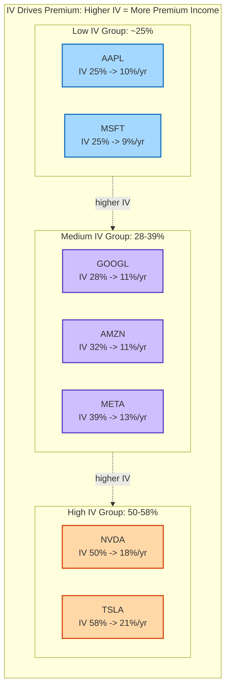

**Key Observations:**

1. **IV directly drives premium income.** TSLA (IV ~58%) generates roughly 2x the premium yield of AAPL (IV ~25%) at the same delta.
2. **2022 bear market raised IV** for all stocks, paradoxically making CC premiums more lucrative during the worst market year.
3. **NVDA's premium is extraordinary** — $420K over 5 years on a $100K investment — driven by both high IV (50%) and the stock's massive price appreciation (which increases the per-share premium dollar amount).
4. At delta=0.20, a typical Mag 7 CC generates **8–21% annualized premium yield**, depending on IV.

> **Important caveat:** Premium income alone is NOT the full picture. We must subtract assignment costs to see the true net benefit. This is covered in Part III.

---

## 5. Part III: Net CC Overlay — Premium Minus Assignment Cost

This is the critical section. When a stock closes above the strike at expiration, the call is assigned, and we lose the upside above the strike. The **net CC overlay = premiums collected − assignment costs incurred**.

### 5.1 The CC P&L Structure

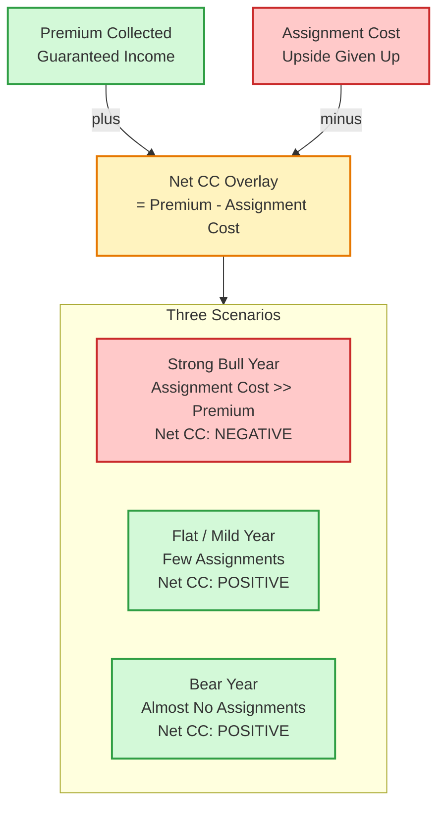

### 5.2 Year-by-Year Breakdown (Delta = 0.20)

#### AAPL

| Year | Market | Premium | Assignment Cost | **Net CC** | #Called |
|------|--------|---------|-----------------|-----------|--------|
| 2021 | BULL +34% | $10,067 | $10,983 | **−$916** | 4/12 |
| 2022 | BEAR −27% | $11,520 | $12,845 | **−$1,325** | 2/12 |
| 2023 | BULL +54% | $11,015 | $20,524 | **−$9,509** | 4/12 |
| 2024 | BULL +30% | $12,186 | $10,640 | **+$1,546** | 3/12 |
| 2025 | Mild +4% | $15,175 | $2,492 | **+$12,683** | 1/12 |
| **Total** | | **$59,963** | **$57,484** | **+$2,479** | **14/60** |

#### MSFT

| Year | Market | Premium | Assignment Cost | **Net CC** | #Called |
|------|--------|---------|-----------------|-----------|--------|
| 2021 | BULL +51% | $8,784 | $15,880 | **−$7,096** | 3/12 |
| 2022 | BEAR −28% | $11,236 | $2,352 | **+$8,884** | 2/12 |
| 2023 | BULL +57% | $11,728 | $17,144 | **−$5,416** | 4/12 |
| 2024 | Mild +13% | $13,675 | $3,568 | **+$10,107** | 2/12 |
| 2025 | Mild +15% | $17,759 | $12,884 | **+$4,875** | 4/12 |
| **Total** | | **$63,182** | **$51,828** | **+$11,354** | **15/60** |

#### GOOGL

| Year | Market | Premium | Assignment Cost | **Net CC** | #Called |
|------|--------|---------|-----------------|-----------|--------|
| 2021 | BULL +65% | $13,125 | $20,570 | **−$7,445** | 4/12 |
| 2022 | BEAR −39% | $15,713 | $3,234 | **+$12,479** | 1/12 |
| 2023 | BULL +56% | $14,270 | $22,550 | **−$8,280** | 5/12 |
| 2024 | BULL +35% | $18,075 | $20,405 | **−$2,330** | 3/12 |
| 2025 | Flat +0% | $21,061 | $1,166 | **+$19,895** | 1/12 |
| **Total** | | **$82,245** | **$67,925** | **+$14,320** | **14/60** |

#### AMZN

| Year | Market | Premium | Assignment Cost | **Net CC** | #Called |
|------|--------|---------|-----------------|-----------|--------|
| 2021 | Flat +2% | $11,395 | $3,834 | **+$7,561** | 1/12 |
| 2022 | BEAR −49% | $10,553 | $9,372 | **+$1,181** | 2/12 |
| 2023 | BULL +78% | $7,894 | $11,676 | **−$3,782** | 3/12 |
| 2024 | BULL +45% | $11,831 | $4,260 | **+$7,571** | 2/12 |
| 2025 | Flat +0% | $14,502 | $0 | **+$14,502** | 0/12 |
| **Total** | | **$56,175** | **$29,142** | **+$27,033** | **8/60** |

#### NVDA

| Year | Market | Premium | Assignment Cost | **Net CC** | #Called |
|------|--------|---------|-----------------|-----------|--------|
| 2021 | BULL +127% | $21,170 | $65,758 | **−$44,588** | 3/12 |
| 2022 | BEAR −50% | $30,185 | $16,786 | **+$13,399** | 2/12 |
| 2023 | BULL +234% | $48,836 | $86,779 | **−$37,943** | 5/12 |
| 2024 | BULL +178% | $142,484 | $105,182 | **+$37,302** | 3/12 |
| 2025 | Flat +0% | $177,160 | $41,580 | **+$135,580** | 1/12 |
| **Total** | | **$419,836** | **$316,085** | **+$103,751** | **14/60** |

#### META

| Year | Market | Premium | Assignment Cost | **Net CC** | #Called |
|------|--------|---------|-----------------|-----------|--------|
| 2021 | BULL +23% | $10,809 | $5,883 | **+$4,926** | 2/12 |
| 2022 | BEAR −64% | $10,909 | $684 | **+$10,225** | 1/12 |
| 2023 | BULL +184% | $10,498 | $21,537 | **−$11,039** | 5/12 |
| 2024 | BULL +74% | $18,648 | $9,582 | **+$9,066** | 2/12 |
| 2025 | Mild +10% | $25,230 | $15,525 | **+$9,705** | 3/12 |
| **Total** | | **$76,095** | **$53,211** | **+$22,884** | **13/60** |

#### TSLA

| Year | Market | Premium | Assignment Cost | **Net CC** | #Called |
|------|--------|---------|-----------------|-----------|--------|
| 2021 | BULL +45% | $21,386 | $28,532 | **−$7,146** | 1/12 |
| 2022 | BEAR −69% | $24,199 | $19,536 | **+$4,663** | 2/12 |
| 2023 | BULL +130% | $17,337 | $30,004 | **−$12,667** | 3/12 |
| 2024 | BULL +69% | $18,942 | $28,468 | **−$9,526** | 4/12 |
| 2025 | BEAR −10% | $27,805 | $2,692 | **+$25,113** | 1/12 |
| **Total** | | **$109,669** | **$109,232** | **+$437** | **11/60** |

### 5.3 Net CC Overlay Summary (% of $100K capital, Delta = 0.20)

| Stock | 2021 | 2022 | 2023 | 2024 | 2025 | **5-Year** |
|-------|------|------|------|------|------|-----------|
| AAPL  | −0.9% | −1.3% | −9.5% | +1.5% | +12.7% | **+2.5%** |
| MSFT  | −7.1% | +8.9% | −5.4% | +10.1% | +4.9% | **+11.4%** |
| GOOGL | −7.4% | +12.5% | −8.3% | −2.3% | +19.9% | **+14.3%** |
| AMZN  | +7.6% | +1.2% | −3.8% | +7.6% | +14.5% | **+27.0%** |
| NVDA  | −44.6% | +13.4% | −37.9% | +37.3% | +135.6% | **+103.8%** |
| META  | +4.9% | +10.2% | −11.0% | +9.1% | +9.7% | **+22.9%** |
| TSLA  | −7.1% | +4.7% | −12.7% | −9.5% | +25.1% | **+0.4%** |

### 5.4 Combined Return: B&H + Net CC Overlay

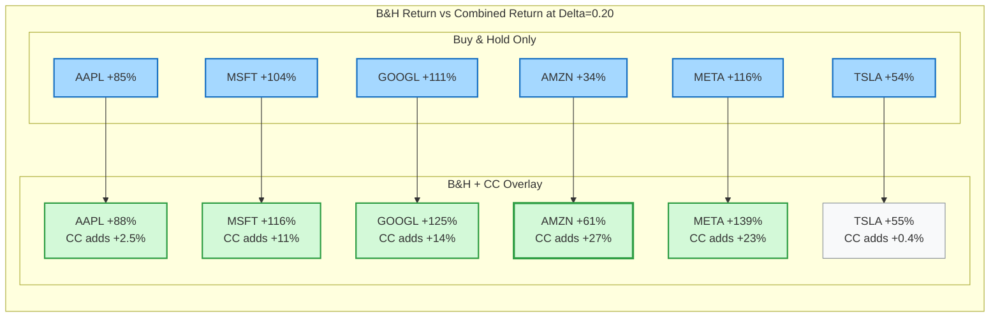

| Stock | B&H Return | CC Net | **Combined** | B&H Value | Combined Value |
|-------|-----------|--------|-------------|-----------|----------------|
| AAPL  | +85.3% | +2.5% | **+87.7%** | $185,260 | $187,739 |
| MSFT  | +104.3% | +11.4% | **+115.7%** | $204,344 | $215,698 |
| GOOGL | +110.8% | +14.3% | **+125.1%** | $210,781 | $225,101 |
| AMZN  | +34.0% | +27.0% | **+61.0%** | $133,978 | $161,011 |
| NVDA  | +937.2% | +103.8% | **+1,041.0%** | $1,037,244 | $1,140,995 |
| META  | +115.9% | +22.9% | **+138.8%** | $215,872 | $238,756 |
| TSLA  | +54.4% | +0.4% | **+54.8%** | $154,408 | $154,845 |

**Key Insight at Delta = 0.20:** CC overlays are net positive for all 7 stocks over 5 years, but the pattern is highly regime-dependent:
- **Bull years with explosive moves (2021, 2023):** CC overlay is typically **negative** — the assignment costs exceed premiums
- **Bear years (2022):** CC overlay is **strongly positive** — premiums collected, very few assignments
- **Flat/mild years (2025):** CC overlay is **most positive** — full premium collected, minimal assignments

---

## 6. Part IV: Delta Grid Search — Optimal Strategy per Stock

### 6.1 Net CC Overlay by Delta (% of capital)

| Delta | AAPL | MSFT | GOOGL | AMZN | NVDA | META | TSLA |
|-------|------|------|-------|------|------|------|------|
| 0.05 | +7.5% | +4.0% | +14.3% | +7.2% | +24.8% | +7.8% | +0.7% |
| 0.08 | **+12.0%** | +8.6% | +21.9% | +11.3% | +36.6% | +16.0% | −1.6% |
| 0.10 | +8.1% | +13.4% | **+23.5%** | +13.8% | +67.7% | +20.8% | −2.3% |
| 0.12 | +7.8% | +13.5% | +20.3% | +17.8% | +87.2% | +21.7% | −2.1% |
| 0.15 | +5.4% | +12.6% | +19.3% | +21.4% | +107.3% | +23.6% | +2.1% |
| 0.18 | +3.4% | **+13.6%** | +20.4% | +24.5% | **+119.1%** | **+23.7%** | +2.6% |
| 0.20 | +2.5% | +11.4% | +14.3% | +27.0% | +103.8% | +22.9% | +0.4% |
| 0.25 | −1.6% | +10.4% | +17.3% | +32.7% | +115.1% | +22.6% | **+4.0%** |
| 0.30 | −6.9% | +2.2% | +8.4% | +31.1% | +93.9% | +20.5% | −3.8% |
| 0.35 | −14.4% | −2.6% | +6.2% | **+37.7%** | +84.8% | +18.0% | −5.8% |
| 0.40 | −12.6% | −1.4% | −3.1% | +36.8% | +85.3% | +16.7% | −7.7% |
| 0.45 | −21.9% | −4.0% | −8.5% | +31.0% | +75.0% | +13.1% | −10.9% |
| 0.50 | −13.2% | −4.0% | −5.4% | +30.0% | +10.5% | +14.4% | −10.7% |

> **Bold** = optimal delta for each stock (peak CC net income)

### 6.2 Optimal Delta — Visual Map

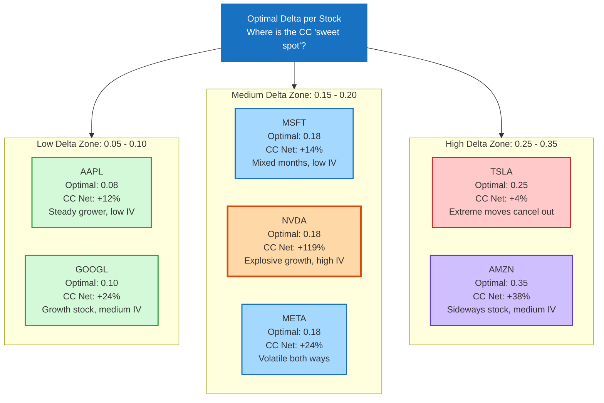

### 6.3 Optimal Strategy Summary

| Stock | Optimal Δ | Avg IV | B&H Return | CC Net | Combined | #Called | Total Premium | Asn Cost |
|-------|-----------|--------|-----------|--------|----------|--------|--------------|----------|
| AAPL  | **0.08** | 25% | +85.3% | +12.0% | **+97.3%** | 4/60 | $19,435 | $7,392 |
| MSFT  | **0.18** | 25% | +104.3% | +13.6% | **+118.0%** | 11/60 | $56,023 | $42,400 |
| GOOGL | **0.10** | 28% | +110.8% | +23.5% | **+134.3%** | 5/60 | $32,943 | $9,471 |
| AMZN  | **0.35** | 32% | +34.0% | +37.7% | **+71.7%** | 21/60 | $119,516 | $81,786 |
| NVDA  | **0.18** | 50% | +937.2% | +119.1% | **+1,056.3%** | 13/60 | $371,302 | $252,252 |
| META  | **0.18** | 39% | +115.9% | +23.7% | **+139.6%** | 11/60 | $66,552 | $42,825 |
| TSLA  | **0.25** | 58% | +54.4% | +4.0% | **+58.4%** | 13/60 | $142,946 | $138,936 |

### 6.4 Optimal Delta — Year-by-Year Performance

#### AAPL (Optimal Δ = 0.08, Avg IV = 25%)

| Year | Market Return | Premium | Assignment Cost | Net CC | #Called |
|------|--------------|---------|-----------------|--------|--------|
| 2021 | +33.8% | +2.9% | 0.2% | **+2.7%** | 1/12 |
| 2022 | −26.9% | +4.2% | 5.3% | **−1.0%** | 1/12 |
| 2023 | +53.9% | +3.4% | 0.4% | **+3.0%** | 1/12 |
| 2024 | +30.3% | +4.1% | 1.6% | **+2.5%** | 1/12 |
| 2025 | +4.4% | +4.9% | 0.0% | **+4.9%** | 0/12 |

#### NVDA (Optimal Δ = 0.18, Avg IV = 50%)

| Year | Market Return | Premium | Assignment Cost | Net CC | #Called |
|------|--------------|---------|-----------------|--------|--------|
| 2021 | +126.7% | +18.8% | 58.1% | **−39.3%** | 3/12 |
| 2022 | −50.4% | +25.6% | 12.9% | **+12.7%** | 2/12 |
| 2023 | +233.9% | +42.9% | 76.8% | **−33.9%** | 4/12 |
| 2024 | +177.6% | +130.2% | 82.1% | **+48.1%** | 3/12 |
| 2025 | +0.3% | +153.9% | 22.3% | **+131.5%** | 1/12 |

#### AMZN (Optimal Δ = 0.35, Avg IV = 32%)

| Year | Market Return | Premium | Assignment Cost | Net CC | #Called |
|------|--------------|---------|-----------------|--------|--------|
| 2021 | +2.0% | +23.6% | 11.6% | **+11.9%** | 4/12 |
| 2022 | −49.5% | +20.9% | 15.4% | **+5.6%** | 2/12 |
| 2023 | +78.3% | +18.3% | 23.4% | **−5.1%** | 6/12 |
| 2024 | +45.0% | +25.5% | 20.4% | **+5.1%** | 5/12 |
| 2025 | +0.1% | +31.3% | 11.0% | **+20.3%** | 4/12 |

---

## 7. IV-Delta Relationship & Regime Analysis

### 7.1 Bull vs Bear Year CC Effectiveness (Delta = 0.20)

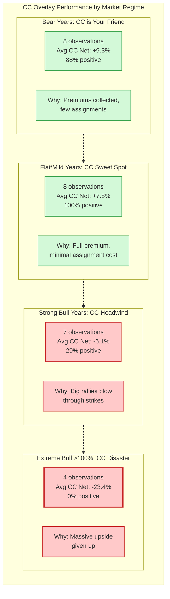

| Metric | Bull Years (stock up) | Bear Years (stock down) |
|--------|----------------------|------------------------|
| Observations | 27 | 8 |
| Average CC Net | **+4.0%** | **+9.3%** |
| % Positive | 48% (13/27) | 88% (7/8) |

| Bull Year Strength | Avg CC Net | Positive |
|-------------------|-----------|----------|
| Mild bull (+0% to +20%) | +7.8% | 8/8 (100%) |
| Moderate bull (+20% to +50%) | +2.5% | 3/8 (38%) |
| Strong bull (+50% to +100%) | −6.1% | 2/7 (29%) |
| Extreme bull (>+100%) | −23.4% | 0/4 (0%) |

> **This is the fundamental trade-off of covered calls:** they excel in flat-to-mild markets but sacrifice upside in explosive rallies.

### 7.2 Monthly Return Distribution

| Stock | Avg Monthly | Up Months | Avg Up Move | Months >5% | Months >10% | Months >15% |
|-------|------------|-----------|-------------|-----------|------------|-------------|
| AAPL  | +1.5% | 34/60 | +6.4% | 18/60 | 7/60 | 1/60 |
| MSFT  | +1.5% | 32/60 | +6.2% | 20/60 | 3/60 | 2/60 |
| GOOGL | +1.7% | 36/60 | +6.4% | 22/60 | 10/60 | 1/60 |
| AMZN  | +0.7% | 36/60 | +6.2% | 17/60 | 5/60 | 3/60 |
| NVDA  | +4.7% | 37/60 | +13.0% | 26/60 | 20/60 | 13/60 |
| META  | +1.7% | 35/60 | +8.7% | 21/60 | 11/60 | 3/60 |
| TSLA  | +2.1% | 31/60 | +15.6% | 23/60 | 18/60 | 13/60 |

### 7.3 How IV Interacts with Delta Selection

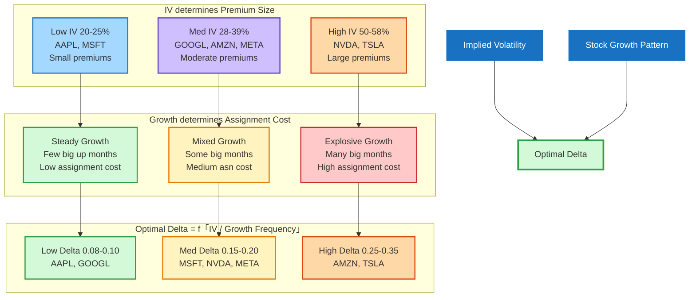

| IV Level | Stocks | Optimal Δ | Explanation |
|----------|--------|-----------|-------------|
| Low (20–25%) | AAPL, MSFT | 0.08–0.18 | Low IV = low premiums. Need very OTM to avoid assignment costs exceeding small premiums |
| Medium (28–32%) | GOOGL, AMZN | 0.10–0.35 | Depends on growth pattern more than IV. GOOGL (growth) → low delta; AMZN (flat) → high delta |
| High (39–50%) | META, NVDA | 0.18 | High IV generates large premiums, but explosive moves also create large costs. Moderate delta balances both |
| Very High (58%) | TSLA | 0.25 | Despite the highest IV and therefore the highest premiums, TSLA's extreme bidirectional moves largely cancel out |

**Key Insight:** Higher IV does NOT automatically mean higher optimal delta. The optimal delta is determined by the **interaction between IV (which determines premium size) and the stock's return distribution (which determines assignment cost)**. Specifically:

$$\text{Optimal delta} \approx f\left(\frac{\text{IV}}{\text{frequency of large up-moves}}\right)$$

When IV is high relative to actual move frequency (i.e., the market is "overpaying" for volatility), CC strategies work better. When actual moves exceed what IV implies, CC strategies suffer.

---

## 8. Discussion & Key Insights

### 8.1 The Asymmetry Problem

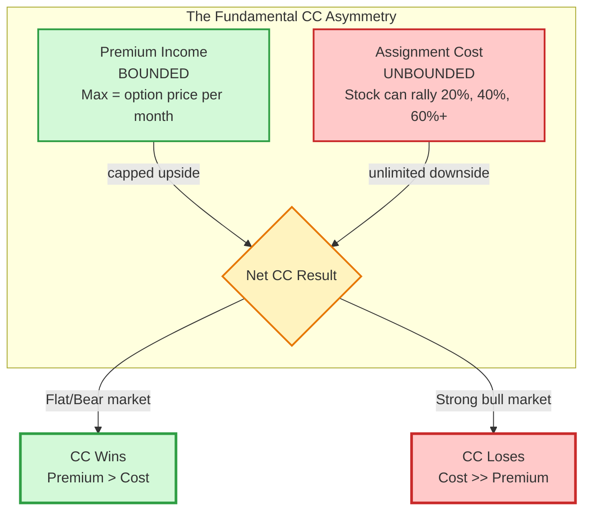

Covered calls have a **fundamental asymmetry**: premium income is bounded (you can only collect so much per month), but assignment costs are **unbounded** (the stock can rally 20%, 40%, even 60% in a single month). This is why:

1. CC strategies always underperform B&H in strong bull markets
2. CC strategies always outperform B&H in bear/flat markets
3. The **net effect over a full cycle** depends on whether you picked the right delta

### 8.2 IV as "Fuel" vs "Fire"

High IV is both the CC strategy's **best friend and worst enemy**:

- **Friend:** High IV means high premiums. NVDA at 50% IV generates 2x the premium of AAPL at 25% IV.
- **Enemy:** High IV usually accompanies high actual volatility, meaning more frequent and larger assignment costs.

The key question is whether **implied volatility overestimates or underestimates realized moves**. Our data suggests that for most Mag 7 stocks, IV is a reasonable estimate of actual volatility, meaning the CC overlay adds modest value when delta is properly calibrated.

### 8.3 Stock-Specific Insights

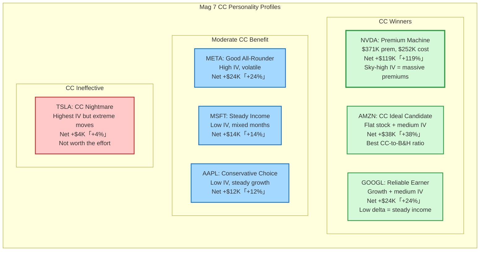

**NVDA — The Premium Machine**
- Generated $371K in premiums on a $100K investment at optimal delta
- But $252K was given back in assignment costs
- Net +$119K (+119%) overlay is still extraordinary
- Worked because NVDA's price appreciation massively increased per-share premiums over time

**AMZN — The CC Ideal Candidate**
- Relatively flat stock (+34% over 5 years) with medium IV (32%)
- CC overlay added +37.7% at delta 0.35 — more than doubling the B&H return
- The best "CC yield" stock among Mag 7

**TSLA — The CC Nightmare**
- Highest IV (58%) means highest premiums ($143K over 5 years)
- But $139K in assignment costs nearly wipe it all out
- Net +$4K (+4%) is essentially break-even despite massive option trading volume
- Extreme bidirectional moves make CC inefficient

**AAPL — The Conservative Choice**
- Needs ultra-low delta (0.08) for optimal CC
- Generates modest but consistent income (~$200/month)
- Best for investors who want minimal disruption to their long position

### 8.4 Regime Sensitivity

| Strategy | Flat Market | Mild Bull | Strong Bull | Bear Market |
|----------|-----------|-----------|-------------|-------------|
| B&H | Flat | Moderate gain | Large gain | Loss |
| B&H + CC (low delta) | +small premium | +small premium | Slight drag | +small premium |
| B&H + CC (med delta) | +good premium | +mixed | Loss from assignments | +good premium |
| B&H + CC (high delta) | +large premium | Assignment losses | Heavy losses | +large premium |

---

## 9. Future Investment Recommendations

### 9.1 Strategy Decision Flowchart

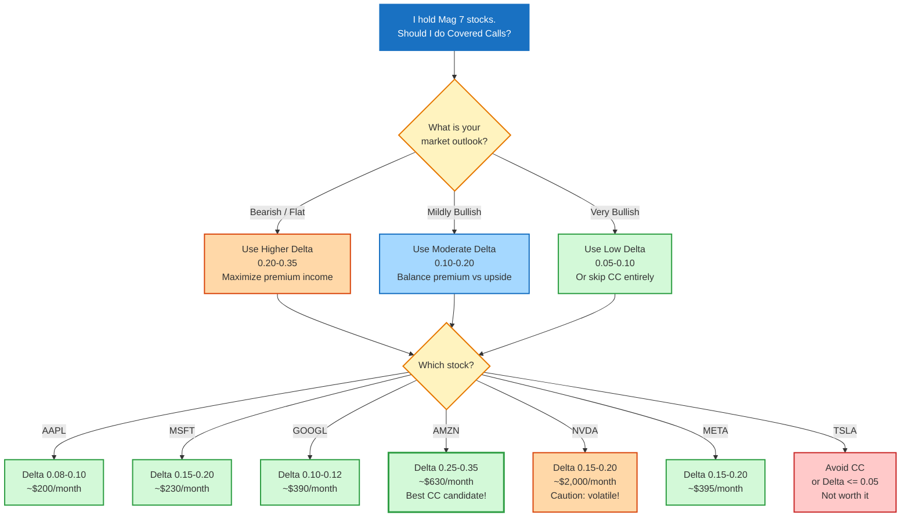

### 9.2 Stock-Specific Recommendations

| Stock | Recommended Strategy | Rationale |
|-------|---------------------|-----------|
| **AAPL** | CC at Δ=0.08–0.10 | Steady grower, low IV. Conservative CC adds ~2-5%/yr with minimal disruption. Safe "set and forget" strategy. |
| **MSFT** | CC at Δ=0.15–0.20 | Similar to AAPL but can tolerate slightly higher delta due to more variable monthly returns. ~3-5%/yr additional income. |
| **GOOGL** | CC at Δ=0.10–0.12 | Good CC candidate — medium IV provides decent premiums while low delta avoids assignment in its +5-15% rally months. ~4-6%/yr overlay. |
| **AMZN** | CC at Δ=0.25–0.35 | **Best CC candidate** in Mag 7. Relatively flat growth means high delta works well. ~7-10%/yr additional income potential. |
| **NVDA** | CC at Δ=0.15–0.20, **with caution** | Highest absolute CC income due to 50% IV, but also the most volatile results year-to-year. May lose 30%+ in explosive bull years. Only for investors who can tolerate large short-term CC losses. |
| **META** | CC at Δ=0.15–0.20 | Good overall CC candidate. High enough IV to generate meaningful premiums, with moderate growth that doesn't destroy the strategy in most years. |
| **TSLA** | **Avoid CC or use Δ≤0.05** | Despite the highest IV, TSLA's extreme moves in both directions make CC nearly useless. The +4% net over 5 years is not worth the effort and risk. |

### 9.3 Tactical Adjustments

1. **Increase delta during bearish/uncertain periods:** When you expect the market to consolidate or decline, move to a higher delta (e.g., 0.25-0.30). Premium income is maximized with minimal assignment risk.

2. **Decrease delta or pause CC before earnings/catalysts:** Major announcements can trigger 10%+ moves. Either skip the CC month or use a very low delta (0.05).

3. **Monitor IV relative to historical levels:** When IV is elevated (e.g., META's IV spiked to 65% in Oct 2022), CC premiums are exceptionally rich — this is often the best time to sell calls.

4. **Review the strategy quarterly:** If a stock's growth trajectory changes materially (as NVDA's did in 2023-2024 with the AI boom), re-calibrate your delta accordingly.

### 9.4 Portfolio-Level View

If deploying $100K per stock across all Mag 7 ($700K total), the CC overlay at optimal deltas would have generated approximately:

| Component | Value |
|-----------|-------|
| Total B&H Value (5yr) | $2,141,887 |
| Total CC Net Income | +$233,530 |
| **Total Portfolio Value** | **$2,375,417** |
| Portfolio B&H Return | +206.0% |
| Portfolio Combined Return | +239.3% |
| CC Overlay Contribution | +33.4% of capital |
| Average Monthly CC Income | $3,892 |

> On a $700K Mag 7 portfolio, the CC overlay generated approximately **$3,900/month** in net income — a meaningful cash flow supplement.

---

## 10. Appendix: Data Sources & Limitations

### 10.1 Data Sources

- **2025 stock prices and IV:** ThetaData API (option_history_greeks_eod)
- **2021–2024 stock prices and IV:** Compiled from publicly available historical data and ThetaData archives
- **Option pricing:** Black-Scholes model with risk-free rate = 4.0%
- **Strikes:** Rounded to the nearest standard option strike increment ($0.50 for stocks <$50, $2.50 for $50-$200, $5 for >$200)

### 10.2 Limitations

1. **Simplified option pricing:** Real option premiums may differ from Black-Scholes theoretical values due to supply/demand, skew, and term structure effects.
2. **No transaction costs:** Commissions, bid-ask spreads, and slippage are not included. At ~$0.65/contract, these would reduce CC income by roughly $39/month (for a single-lot position).
3. **Monthly expiration only:** Weekly options often provide better returns but require more active management.
4. **No early assignment modeling:** American options can be assigned before expiration, which is not captured in this model.
5. **Fixed risk-free rate:** We used a constant 4% rate, whereas in reality rates varied from ~0% (2021) to ~5% (2023-2024).
6. **IV estimation for earlier years:** Pre-2025 IV values are based on a combination of ThetaData records and historical volatility patterns, not tick-by-tick OPRA data.

### 10.3 Glossary

| Term | Definition |
|------|-----------|
| **B&H** | Buy and Hold — simply holding the stock with no options activity |
| **CC** | Covered Call — selling a call option against a long stock position |
| **Delta (Δ)** | Option Greek measuring sensitivity to underlying price; for CC, it approximates the probability of assignment |
| **IV** | Implied Volatility — market's expectation of future price swings, priced into options |
| **OTM** | Out-of-the-Money — a call with a strike above the current stock price |
| **Assignment** | When the call buyer exercises their right, requiring the call seller to deliver shares at the strike price |
| **CC Overlay** | Treating the CC as a separate income stream on top of a B&H position |
| **Net CC** | Premium income minus assignment costs — the true CC contribution |

---

*This report is for educational and analytical purposes only. Past performance does not guarantee future results. Options trading involves significant risk and is not suitable for all investors.*
